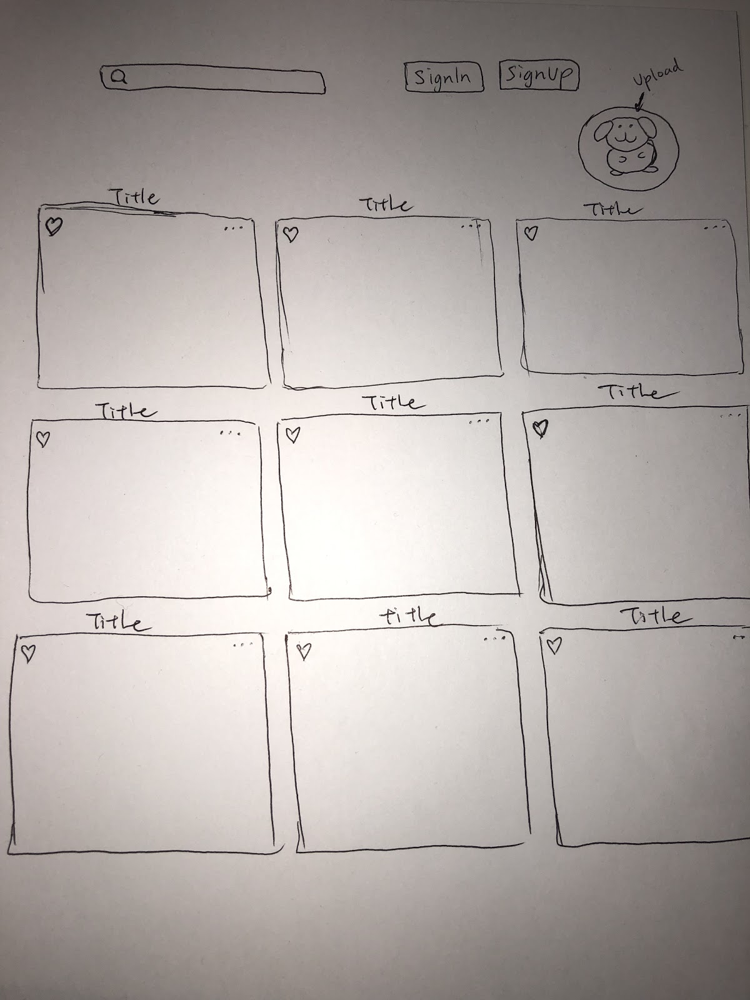
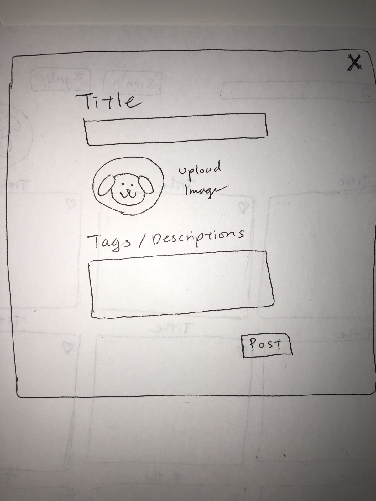
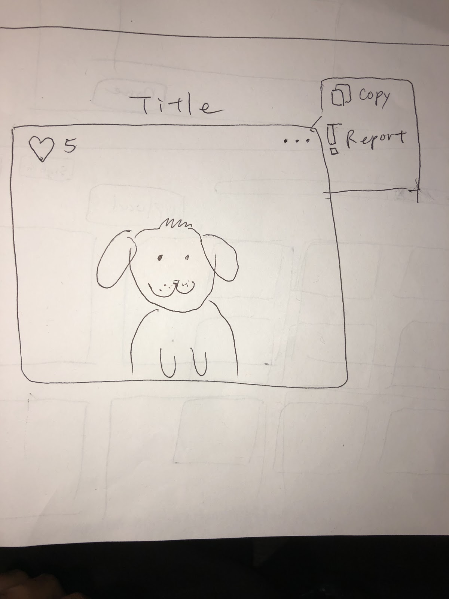
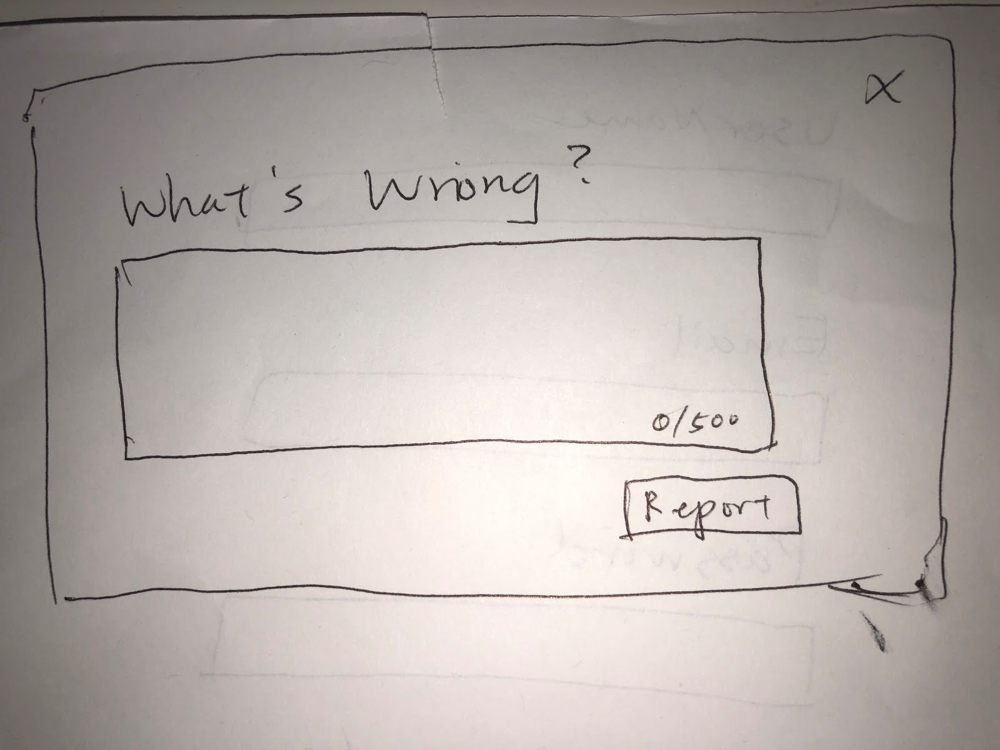
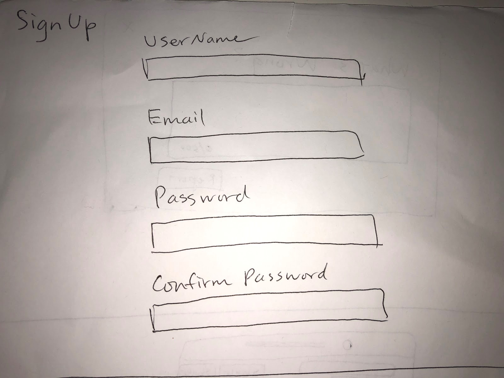
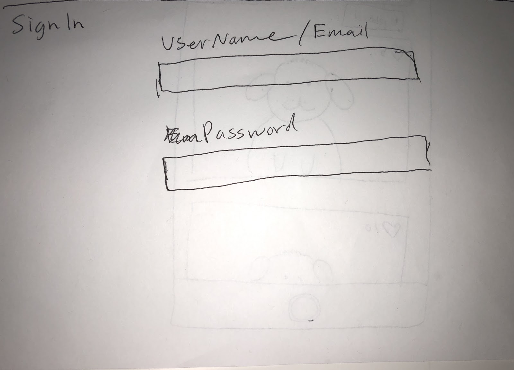
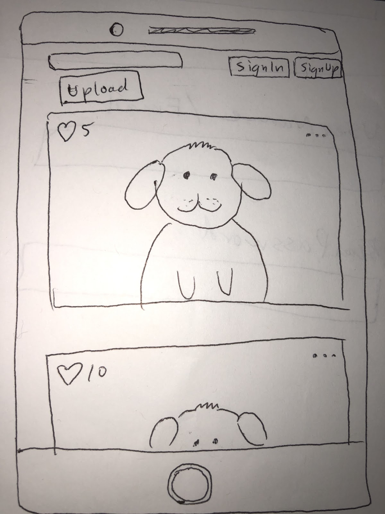

# Design Specification

## Problem
People working 8-hour or more workdays are more productive when taking breaks. Not taking breaks can hurt one’s productivity. Humans are not able to concentrate for 8+ hours, so surprisingly we are only productive for on average 3 of the 8 hours (Curtin 2016). Not taking breaks can come with the negative effects of decision fatigue and lack of focus. Based on optimal break studies, it is best to take short breaks every hour or so (5-15 min every hour).

Based on these findings, our group is looking to create a dog finding site that not only provides a mental stress relief but also will not tempt workers to take longer breaks that might hinder their production. The dog finding page on Facebook is a popular place to visit for a break, but many people get caught up looking through their feed for much longer than they intended. Our dog finding site will solely focus on looking at and posting pictures of dogs to provide the optimal break for workers to help them stay focused.

## Solution

### Main Screen

The first screen the user sees is the main screen, which contains a search box, upload, sign in, sign up buttons, and a grid of images. On a mobile device, the image grid becomes an image feed. When the user presses the sign in or sign up buttons, a popup appears to allow the user to sign in, or sign up, respectively. If the user types into the search box and presses enter, the image grid is filtered to only include results relevant to the search terms. Search terms can be plain text, or tags preceded with a “#”. Finally, when an image is clicked, the single image popup view is shown.

### Upload Image

When the user presses the upload button, a popup appears to allow the user to upload an image. User is required to upload image, and able to add title and tags/descriptions for the image. If the user is not signed in, the upload button will not be displayed and “log in” and “sign up” button will be displayed instead.  

### Click on Image

A logged in user is able to like, copy, and report an image, a non-logged in user is only able to copy and report an image. 

### Report Image

To report an image, click on the ellipse on the upper right corner of the image and select report. A popup appears with a textarea in which the user can report what was wrong with the image and click on the report button to submit the report. The textarea restricts the word count to 500 words. The report component is implemented to allow users to help notify us of any pictures that are not dog related or have inappropriate titles. 

### Sign Up

The design rationale for creating  accounts is to help monitor the site. If a user is uploading pictures that are not related to dogs, their pictures can be linked back to their account and further action can be taken.

When the user presses the signup button, a popup shows up that asks for a username, email, password, and password confirmation. The username has to have at least one character and be unique, the email will be checked to ensure that it is in valid format, and the password has to be at least 6 characters. Password confirmation has to be the same as the password. If a field is missing, a missing field error message is shown. If field is incorrect, an error message explaining what was incorrect is shown. If all inputs are correct, then a message will show that confirms an account was set up correctly.

### Sign In

The first input box will prompt for either the user’s email or username, and the second input box is the user’s password. Once the user presses submit, if either are incorrect, an error message showing incorrect username or password is shown. If credentials are validated, the user is redirected back to the main page with a message on the top right that shows “Hello {username}”. Once logged in, the user can post pictures, like pictures, and the sign in/up buttons are replaced with sign out

### Sign Out

Once the user signs out, the log in/ sign up buttons reappear, and the sign out button and “Hello {username}”  message disappears. The user can still view pictures but cannot post or like pictures.

### Mobile Look (Responsiveness)

On mobile portrait mode, pictures are arranged in a single column. On mobile landscape mode and wider computer browsers, pictures are aligned in rows of 3 columns each. For all orientations, the sign up/in/out, search, and upload options will be listed at the very top.

